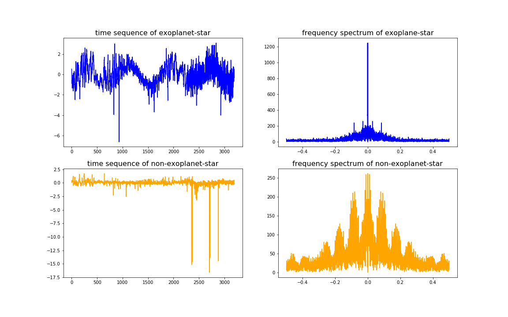

# ExoplanetHunting
Exoplanet Hunting in Deep Space (系外行星探索)  
Based On `SVM` and `CNN`, 0.998 accuracy and 1.0 recall  

### Background  
Before running the code, please Extract the `data.tar.gz` at first.  
下载完成后请先解压`data.tar.gz`再运行程序  

The data describe the change in flux (light intensity) of several thousand stars. Each star has a binary label of 2 or 1. 2 indicated that that the star is confirmed to have at least one exoplanet in orbit; some observations are in fact multi-planet systems.   

As you can imagine, planets themselves do not emit light, but the stars that they orbit do. If said star is watched over several months or years, there may be a regular 'dimming' of the flux (the light intensity). This is evidence that there may be an orbiting body around the star; such a star could be considered to be a 'candidate' system. Further study of our candidate system, for example by a satellite that captures light at a different wavelength, could solidify the belief that the candidate can in fact be 'confirmed'.  

Dataset is also available at https://www.kaggle.com/keplersmachines/kepler-labelled-time-series-data

这些数据描述了数千颗恒星的光强的变化。每颗星都有一个2或1的二元标签。2表示该恒星在轨道上至少有一颗系外行星;一些观测实际上是多行星系统。  

行星本身并不会发光，但它们所环绕的恒星会发光。如果在几个月或几年的时间里观察到恒星，可能会有一个规律的“变暗”(光强)。这证明了恒星周围可能有一个绕轨道运行的天体;这样一颗恒星可以被认为是“候选宜居”系统。进一步研究我们的“候选宜居”系统，例如通过卫星捕捉不同波长的光线，可以进一步找出那些宜居的天体系统

### Description
##### Method
* standardize the light intensity values of each star.
* transform the time sequence into frequency spectrum by Fourier Transformation.
* oversample the negative data.
* decompose the feature's dimension by PCA (SVM only).
* train the classifier based on both SVM and CNN respectively.  

  
##### Result of SVM
              precision    recall  f1-score   support

         0.0       1.00      1.00      1.00       565
         1.0       0.60      0.60      0.60         5
         
         accuracy: 0.99298  
##### Result of CNN  

              precision    recall  f1-score   support

         0.0       1.00      1.00      1.00       565
         1.0       0.83      1.00      0.91         5

         accuracy: 0.99824  

### Data  
Train set:  
* `5087` rows or observations.
* 3198 columns or features.
* Column 1 is the label vector. Columns 2 - 3198 are the flux values over time.
* `37` confirmed exoplanet-stars and 5050 non-exoplanet-stars.

Test set:  
* `570` rows or observations.
* 3198 columns or features.
* Column 1 is the label vector. Columns 2 - 3198 are the flux values over time.
* `5` confirmed exoplanet-stars and 565 non-exoplanet-stars.

### Author
欢迎交流  
e-mail:`dengxiuqi@163.com`  
wechat:`dengxiuqi007`  
2019.6